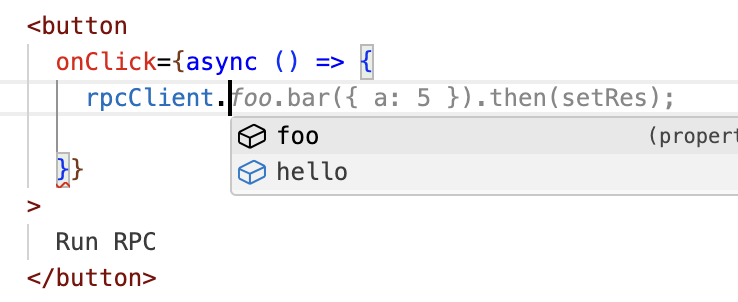

# tRPC clone (in under 50 lines of code)

[tRPC](https://trpc.io/) enables typesafe, remote function execution of server code from the client side. This repo is a proof of concept replication tRPC, in [under 50 lines of code](./src/rpc-lib/).

### Codesandbox Demo

https://githubbox.com/JoeRoddy/trpc-clone-next

- tRPC-esque "library" at [./src/rpc-lib](./src/rpc-lib/)

Implementation - simple Next.js example usage:

- API code at [./src/app/api/rpc/route.ts](./src/app/api/rpc/route.ts)
- client code at [./src/app/page.tsx](./src/app/page.tsx)

## How It's Used

- example server:

  ```ts
  import { handleRpcRequest } from 'rpc-lib/server';
  // my-server.ts
  const myApi = {
    foo: {
      bar: ({ a }: { a: number }) => a * 2,
    },
    hello: () => 'hello world!',
  };

  app.post('/api/rpc', async (req, res) => {
    const { path, args } = req.body;
    const res = await handleRpcRequest({ api: myApi, req: { path, args } });
    res.status(200).json(res);
  });

  export type MyApiType = typeof myApi;
  ```

- example client:

  ```ts
  // my-client.ts
  import { createRpcClient } from 'rpc-lib/client';
  import { type MyApiType } from './my-server.ts';

  // infer types from generic
  const client = createRpcClient<MyApiType>();

  const result = await client.foo.bar({ a: 1 });
  // get's executed as
  POST /api/rpc -d "{ path: ['foo', 'bar'], args: { a: 1 } }"
  ```

  - the client uses some TS type magic to infer the appropriate types from the structure of your API via the generic passed `createRpcClient<MyApiType>`



## How it works under the hood

- [the client](./src/rpc-lib/client/index.ts) - a [JavaScript proxy](https://developer.mozilla.org/en-US/docs/Web/JavaScript/Reference/Global_Objects/Proxy) that can accept any dynamic function call and executes it as an equivalent POST request:

- your server - `handleRpcRequest()` - a simple implementation that takes the incoming request (`path` and `args`), and an API object, and invokes the function at the given path:
